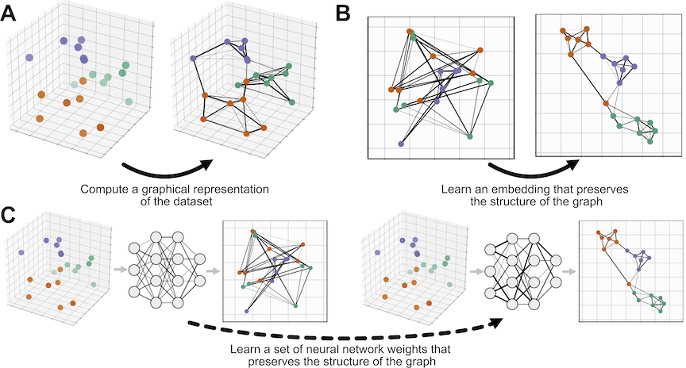
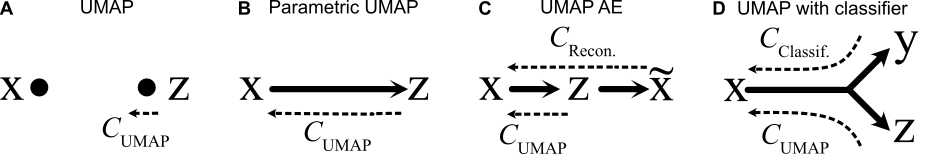
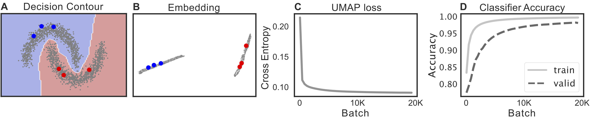
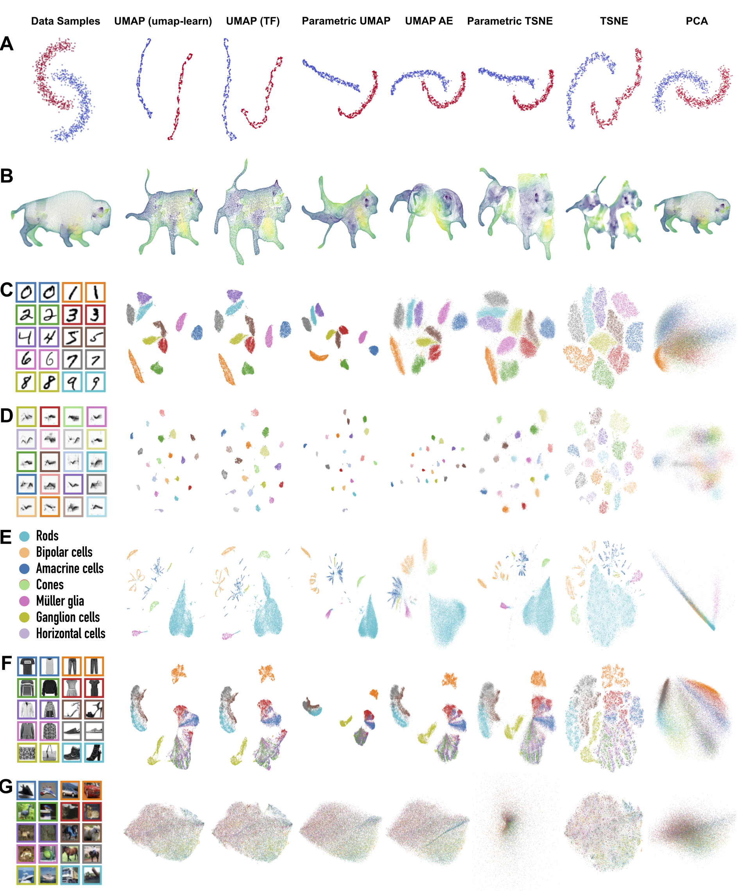

[](https://colab.research.google.com/drive/1lpdCy7HkC5TRI9LfUtIHBBW8oRO86Nvi?usp=sharing)

Parametric UMAP (2020; Code for paper)
==============================




This repository contains the code needed to reproduce the results in the paper "Parametric UMAP: learning embeddings with deep neural networks for representation and semi-supervised learning" by Sainburg, McInnes, and Gentner (2020). 

Citation: 

```
@article{parametricumap,
  title={Parametric UMAP: learning embeddings with deep neural networks for representation and semi-supervised learning},
  author={Sainburg, Tim and McInnes, Leland and Gentner, Timothy Q},
}

```

### How to use

The main implementation of this code is available in `umap.parametric_umap` in the [UMAP repository](https://github.com/lmcinnes/umap) (v0.5+). Most people reading this will want to use that code, and can ignore this repository. 

The code in this repository is the 'messy' version. It has custom training loops which are a bit more verbose and customizable. It might be more useful for integrating UMAP into your custom models. 

The code can be installed with `python setup.py develop`. Though, unless you're just trying to reproduce our results, you'll probably just want to pick through the notebooks and tfumap folder for the code relevant to your project. 

In addition, we have a more verbose Colab notebook to walk you through the algorithm:

Parametric UMAP (verbose) [](https://colab.research.google.com/drive/1lpdCy7HkC5TRI9LfUtIHBBW8oRO86Nvi?usp=sharing)


### What's inside

This repo contains the code needed to produce all of the results in the paper. The network architectures we implement (in Tensorflow) are non-parametric UMAP, Parametric UMAP, a UMAP/AE hybrid, and a UMAP/classifier network hybrid. 



The UMAP/classifier hybrid can be used for semisupervised learning on structured data. An example with the moons dataset is shown below, where in the left panel, the colored points are labeled training data, the grey points are unlabled data, and the background is the network's decision boundary. 




The experiments inside use the following datasets and algorithms:




--------

<p><small>Project based on the <a target="_blank" href="https://drivendata.github.io/cookiecutter-data-science/">cookiecutter data science project template</a>. #cookiecutterdatascience</small></p>
